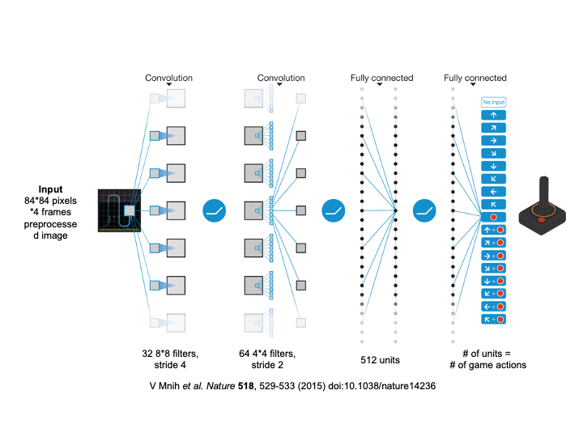
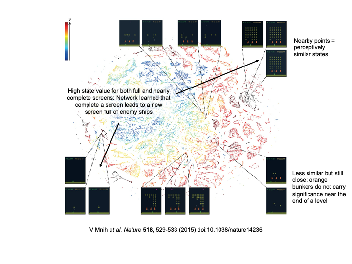

## Table of Contents

1.  Preamble

2.  Summary of Notations

3.  Reinforcement Learning

4.  Deep Reinforcement Learning

# Preamble

Whether we are engaging in a daily conversation or to driving a vehicle, essentially we are picking up on our surrounding environment and making a response simultaneously to the changes in the environment. Essentially, we are learning from our interaction with the environment and executing an action in return. This is the foundation idea that lies in all learning and intelligence [@sutton2018]. A machine learning technique to train software to make decision to achieve the optimal result by performing a sequence of actions in an environment is known as *reinforcement learning* [citation]. A reinforcement learning environment is formalized by an optimal control of Markov decision processes, which can be decompose into three essential parts - sensation, action, and goal [@sutton2018]. A learning agent should be able to sense the state of the environment, and takes series of actions that effects the state and achieve a goal overtime.

The idea of reinforcement learning is further extended to *deep reinforcement learning* that handles more sophisticated tasks. Deep reinforcement learning allows the agent to perform on real-world complexity in higher dimensions by training through deep neural networks. A novel artificial agent, deep Q-network agent was first introduced by Mnih et al. (2015).

# Summary of Notations

| Variable   | Definition                                                  |
|------------|-------------------------------------------------------------|
| $s$        | state                                                       |
| $a$        | action                                                      |
| $t$        | discrete time step                                          |
| $\pi$      | policy, decision rule                                       |
|            |                                                             |
| $s_t$      | state at time $t$                                           |
| $a_t$      | game actions selected from a set of actions                 |
| $x_t$      | result form emulator in the form of vector of pixel values  |
| $r_t$      | reward in game                                              |
| $\gamma$   | discount rate parameter per time step (default set to 0.99) |
| $Q^*(s,a)$ | maximum expected return achieved by policy                  |
| $\theta$   | weight parameter                                            |
| $R_t$      | total reward at time t, dependent                           |

# Reinforcement Learning

## Q-learning Algorithm

In order to teach the agent to achieve the maximum reward, and tie the reward to the actions, we can define the **Optimal action-value function**:
$$
Q^*(s,a) = \max_{\pi} \mathbb{E}[R_t | s_t = s, a_t = a, \pi]
$$
Where, $\pi$ is the policy to guide the action, $s$ is the current state, $a$ is the current action, and $R_t$ is the total reward at time $t$.

This function obey *Bellman equation*, which is based on the following intuition: the expected return for taking the optimal action from a given state is the sum of the immediate reward from the current state to the next state, and the expected return from the next state to the goal state. Following this equation, The optimal action-value function can be expressed as:

$$
Q^*(s,a) = \mathbb{E}_{s'}[r + \gamma \max_{a'} Q^*(s',a') | s,a]
$$
Where $r$ is the current reward, $\gamma$ is the discount rate parameter, $s'$ is the next state and $a'$ is the next action.

Fig \@ref(fig:qvalue) shows a visualization of the learned action-value function on the game Pong. Pong is a two-player game where the goal is to hit the ball past the opponent's paddle. The agent controls one of the paddles (green one) and the opponent is controlled by a simple AI. At time point 1, the ball is moving towards the paddle controlled by the agent on the right side of the screen and the q-values of all actions are around 0.7, reflecting the expected value of this state based on previous experience. At time point 2, the agent starts moving the paddle towards the ball and the value of the ‘up’ action stays high while the value of the ‘down’ action falls to −0.9. This reflects the fact that pressing ‘down’ would lead to the agent losing the ball and incurring a reward of −1 (loose the game). At time point 3, the agent hits the ball by pressing ‘up’ and the expected reward keeps increasing until time point 4, when the ball reaches the left edge of the screen and the value of all actions reflects that the agent is about to receive a reward of 1. Note, the dashed line shows the past trajectory of the ball purely for illustrative purposes (that is, not shown during the game).

(\#fig:qvalue)Visualization if the learned action-value function on the game Pong

## Q-network: approximator of Q-value function

Achieving optimal target values: $r + \gamma \max_{a'}Q^*(s',a')$ is hard and computationally expensive, especially when the state space is large. To address this issue, we can approximate the target values using:
$$
r + \gamma \max_{a'}Q(s',a';\theta_i^-)
$$

where $\theta_i^-$ are the parameters from some previous iteration. The Q-network are defined as a neural network approximator with weights $\theta$. The Q-network is trained to minimize the loss function:
$$
L_i(\theta_i) = \mathbb{E}_{s,a,r,s'}[(\underbrace{r + \gamma \max_{a'}Q(s',a';\theta_i^-)}_{\text{traget value}} - \underbrace{Q(s,a;\theta_i)}_{\text{estimation}})^2]
$$
and the gradient of the loss function can be written as:

$$
\nabla_{\theta_i}L_i(\theta_i) = \mathbb{E}_{s,a,r,s'}\left[\left(r + \gamma \max_{a'}Q(s',a';\theta_i^-) - Q(s,a;\theta_i)\right)\nabla_{\theta_i}Q(s,a;\theta_i)\right]
$$

The target value: $r + \gamma \max_{a'}Q(s',a';\theta_i^-)$ can be viewed as the reward you will get using parameters from some previous iteration, and the estimation: $Q(s,a;\theta_i)$ is the reward you will get using the current parameters. The loss function is the squared difference between the target value and the estimation. 

# Deep Reinforcement Learning

The paper expand the Q-learning algorithm which described above by using a deep neural network to approximate the Q-value function with 3 new features covered below.

## Convoutional network

(\#fig:network)Visualization of the network architecture

The first new features used in the paper is the convolutional network used to process the image of the games into states which will be fed into the Q-network (shown in Fig \@ref(fig:network)). 

Before feed the images to the network, some preprocessing need to be done as the raw images of the emulator(Atari 2600), which are 210 × 160 pixel images with a 128-colour palette, is demanding in terms of computation and memory requirements. First, to encode a single frame the authors take the maximum value for each pixel colour value over the frame being encoded and the previous frame. This was necessary to remove flickering that is present in games where some objects appear only in even frames while other objects appear only in odd frames, an artefact caused by the limited number of sprites Atari 2600 can display at once. Second, authors then extract the Y channel, also known as luminance, from the RGB frame and rescale it to 84 × 84. The function ($\phi$) from algorithm 1 described below applies this preprocessing to the 4 most recent frames and stacks them to produce the input to the Q-function.

After image preprocessing, an 84 × 84 × 4 image will be used to train the network. The first hidden layer convolves 32 filters of 8 × 8 with stride 4 with the input image and applies a rectifier nonlinearity. The second hidden layer convolves 64 filters of 4 × 4 with stride 2, again followed by a rectifier nonlinearity. This is followed by a third convolutional layer that convolves 64 filters of 3 × 3 with stride 1 followed by a rectifier. The final hidden layer is fully-connected and consists of 512 rectifier units. The output layer is a fully-connected linear layer with a single output for each valid action (Q-value).

(\#fig:tsne)Two-dimensional t-SNE visualization of the representations in the last hidden layer assigned by the network to game states experienced while playing Space Invaders

Fig \@ref(fig:tsne) shows that the convolutional network is able to learn the representation of the game states that are useful for predicting the Q-values of the actions. The plots are generated by running t-SNE algorithem on the last hidden layer representations assigned by the network to game states experienced while playing Space Invaders. The dots are colored according to $V$: the maximum expected reward of a state predicted by the agent (network) for the corresponding game states. The agent can separate full screens and nearly empty screens while predicting both of them with highest values because it learned that completing a screen leads to a new screen full of enemy ships. Partially completed screens are also separated from the full and empty screens, and the agent predicts them with lower values because less reward is available. The agent also learned to neglect the the orange bunkers when the game is near to the next level as they are not important for the reward.

## Experience replay

The second new feature is the experience replay. The experience replay is a technique that randomly samples previous experiences from the agent's memory and uses them to train the network. This technique is used to break the correlation between consecutive samples and stabilize the learning process. In order words, it prevent the agent from learning from only recent experiences, which are highly correlated with current state. The experience replay stores the agent's experiences in a replay memory, which is a dataset of tuples $(s, a, r, s')$. Only the current state $s$, action $a$, reward $r$, and next state $s'$ are stored as any previous information is irrelevant for the agent to make the action. The agent samples a minibatch of experiences from the replay memory and uses them to train the network. The replay memory has a fixed size and when it is full, the oldest experiences are removed to make space for new experiences.

## Second target network $\widehat{Q}$

The third new feature is the introduction of the target network $\hat{Q}$. The agent will use $\hat{Q}$ instead of $Q$ to generates targets $y_j = r + \gamma \max_{a'}Q(s',a';\theta_i^-)$ on each update.

The target network is a copy of the Q-network that is used to compute the target values. The target network is updated less frequently than the Q-network and is used to compute the target values for the loss function. The target network is updated by copying the weights of the Q-network every $C$ steps. This technique is used to stabilize the learning process and prevent the target values from oscillating. The target network is used to compute the target values for the loss function, and the Q-network is used to compute the estimation values. The target values are computed using the target network and the estimation values are computed using the Q-network.

# References

::: {#refs}
:::
